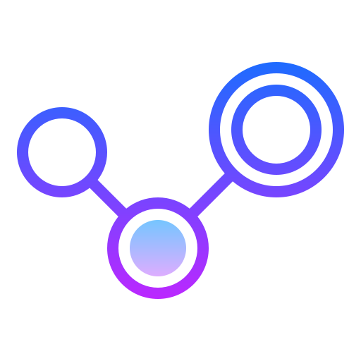

<h1 align="center"><b>Social Network</b></h1>

  A social media platform where people can post pics and connect with other members
      

<!--
  # DEMO 
  - [Yet to be added](Link) - See Video
-->

 
## ⛏️ Built With 
- [Express](https://expressjs.com/) - Backend NodeJs Framework
- [EJS Tamplate](https://ejs.co/) - Web Framework
- [NodeJs](https://nodejs.org/en/) - Server Environment
- [MySQL](https://https://www.mysql.com/) - Relational Database
- [BootStrap 4](https://getbootstrap.com/) - Library
- [AJAX](https://jquery.com/) - Sending async request

## ER Diagram 

    System Architecture
    
   
    
## Screenshots 

- Login Page (_Signup Page is similar_)

- Profile Page

- Home(Feed) Page

- Like-Comments Page

- Search-Box

- Edit Profile Page

## Installing
- [NodeJS](https://nodejs.org/en/) - Install NodeJS

      npm modules
          "body-parser": "^1.19.0",
          "dotenv": "^8.2.0",
          "ejs": "^3.1.5",
          "express": "^4.17.1",
          "express-fileupload": "^1.2.1",
          "express-session": "^1.17.1",
          "json": "^10.0.0",
          "moment": "^2.29.1",
          "multer": "^1.4.2",
          "mysql": "^2.18.1"
 
<!--
## Project Structure 
    => yet to be added
      - yet to be added
    => yet to be added
-->
## Features:

    Registration and Login 
        • User will have to register themselves by providing basic information about them and then they can login into the system. 
        • Once users have logged in, users will be provided with Feeds Section. 

    Feeds section:   
        • All the posts will be viewed here.
        • Can also Like, Comment, Follow. 

    ❖ Profile Section:    
        • Basic information about the user like name,username & followers,following count. 

    ❖ Common Features 
    
        => Follow/Unfollow:
            User can follow or unfollow others user. If user is following a particular user, then that user can see their post on FEED (home-page) SECTION.

        => Search Bar: 
            User can find other people. 

## 5. Functionality
    ❖ Registration
    ❖ Login
    ❖ Update your profile picture and personal details 
    ❖ Create Post
    ❖ Like,comment
    ❖ Follow or Unfollow
    ❖ Post is seen based on following
    ❖ Shows Number of followers and followings
    ❖ You can search a particular user
    ❖ Hover to see no of likes,comments 

## ✍️ Authors 
- [@Sahil Velhal](https://github.com/sahil-777) -  A Social Network

## 🎉 Acknowledgments 
- References
- [Instagram](https://www.instagram.com/?hl=en)
- [LinkedIn](https://www.linkedin.com/)

 
 
